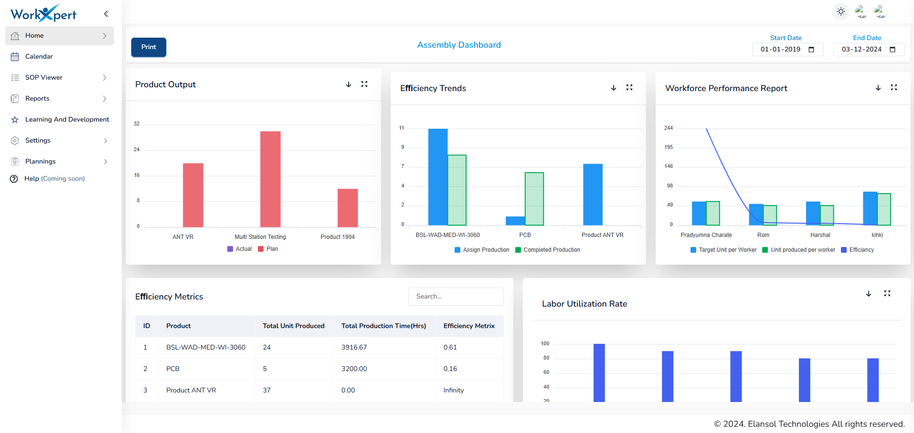
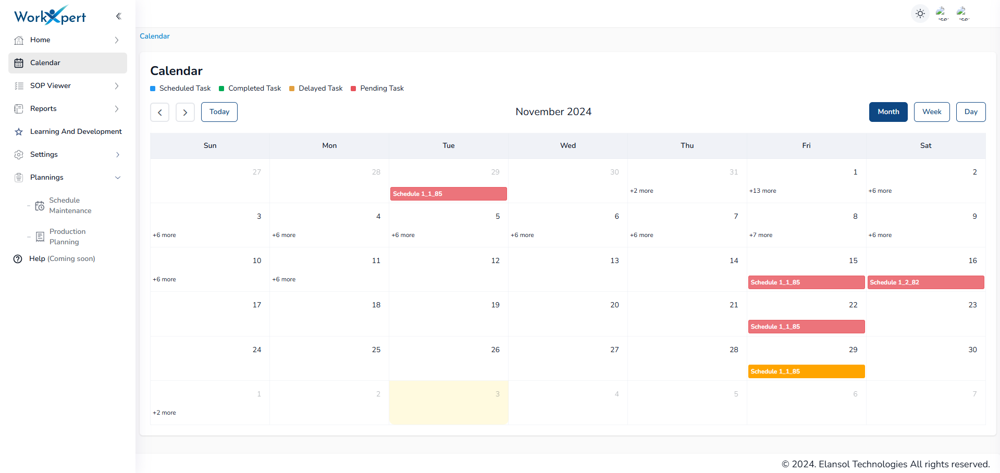
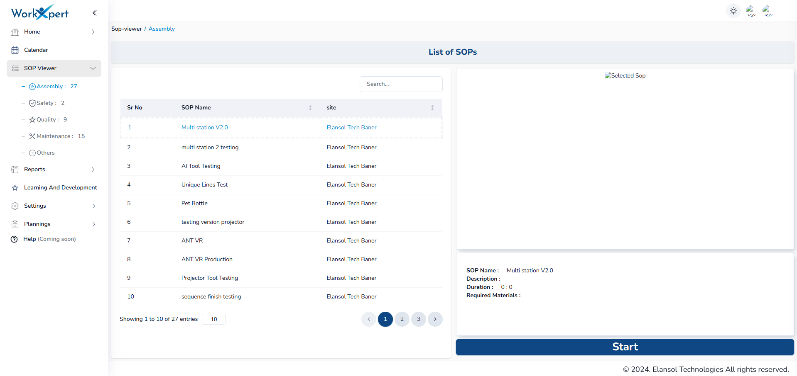
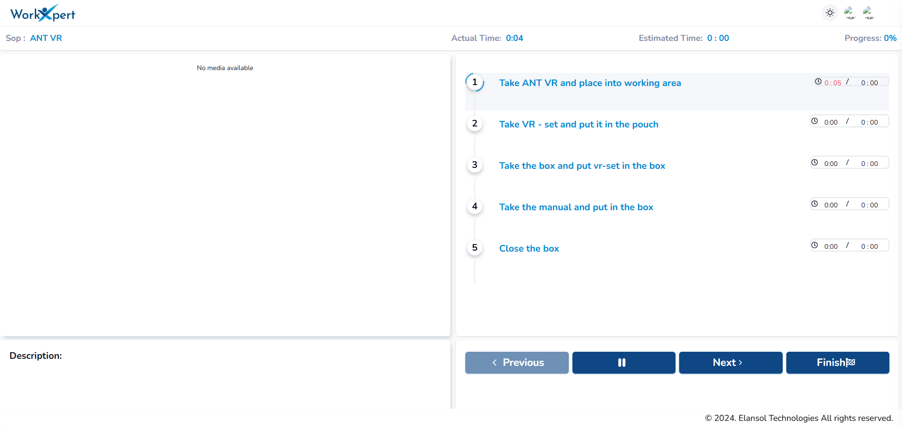
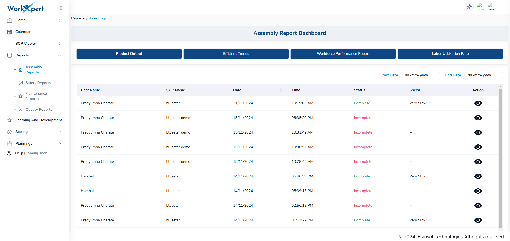

# Software Overview

Here’s a visual guide to the user interface of our software. Below are some key screenshots to explain the features and functionalities.

## Dashboard

This screenshot shows the main dashboard of the application, where users can view key metrics and manage their data.

## Calendar

The calendar feature displays scheduled and planned Standard Operating Procedures (SOPs). This helps users easily track their tasks, view what is planned for a specific day, and manage their workflow efficiently. Users can rely on the calendar to stay informed about their upcoming responsibilities and plan their actions accordingly.

## SOPs List

Here is a screenshot that displays the list of Standard Operating Procedures (SOPs) that have been created. Users can view the SOPs categorized by departments and start a specific SOP directly from this list. This feature ensures that users can quickly access and execute the SOPs relevant to their department.

## SOP Start Page

This screenshot showcases the SOP working page after the SOP has been started. On the left side of the page, users can view images or videos associated with the current step. On the right side, the step name and time allocated for the particular step are displayed. Users can navigate between steps using the "Next" and "Previous" buttons and finish the SOP to generate a detailed report.

## Reports

This screenshot displays the reports of executed SOPs. Users can view the status of each SOP, including whether it is complete, on time, slow, fast, very slow, or very fast. Additionally, users can view detailed reports by clicking on the eye icon, providing deeper insights into the execution of the SOPs.
